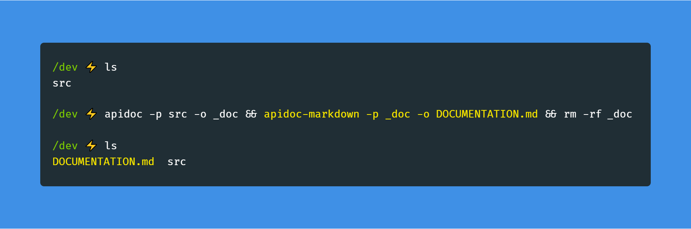

# apidoc-markdown
[](https://github.com/rigwild/apidoc-markdown/actions) [](https://www.npmjs.com/package/apidoc-markdown)  

Generate API documentation in Markdown from [apiDoc](https://github.com/apidoc/apidoc) data. Fully supports programmatic usage.



## Motivation
I really like the idea of generating API documentations with simple annotations like [apiDoc](https://github.com/apidoc/apidoc) does.

Unfortunately, [apiDoc](https://github.com/apidoc/apidoc) outputs a big HTML/CSS/JavaScript project which is not ideal when you want to add it to your GIT project.

`apidoc-markdown` lets you convert data from [apiDoc](https://github.com/apidoc/apidoc) to a nice and portable Markdown documentation! 😊

___

This project is a full-rewrite fork of [@martinj/node-apidoc-markdown](https://github.com/martinj/node-apidoc-markdown), which transfered the npm package name `apidoc-markdown` to me.

## Installation

```bash
# For the command line utility
yarn global add apidoc-markdown
# npm i -g apidoc-markdown

# For programmatic usage
yarn add apidoc-markdown
# npm i apidoc-markdown
```

Then, generate your documentation using your newly added command `apidoc-markdown` or [programmatically](#programmatic-usage-API).

## CLI usage

```
Generate Markdown documentation from apiDoc data.
Usage: apidoc-markdown -p <path> -o <output_file> [-t <template_path>] [--multi] [--createPath] [--prepend <file_path>]

Options:
  --version       Show version number                                                                                                                [boolean]
  --path, -p      Path to generated apiDoc output directory. Where `api_data.json` and `api_project.json` resides.                         [string] [required]
  --output, -o    Output file or directory to write output to.                                                                             [string] [required]
  --template, -t  Path to EJS template file, if not specified default template will be used.                        [string] [default: "templates/default.md"]
  --prepend       Path to file content to add before route groups documentation.                                                                      [string]
  --multi         Output one file per group to the `output` directory.                                                              [boolean] [default: false]
  --createPath    Recursively create directory arborescence to the `output` directory.                                              [boolean] [default: false]
  -h, --help      Show help                                                                                                                          [boolean]

Examples:
  apidoc-markdown -p doc/ -o doc.md                         Generate from `doc/` apiDoc output to `./doc.md`
  apidoc-markdown -p doc -o multi/ --multi --createPath     Generate from `doc/` apiDoc output to `./multi/<group>.md`

apidoc-markdown - https://github.com/rigwild/apidoc-markdown
```

### Command-line arguments
| Option      | Alias         | Description |
| ----------- | ------------- | ----------- |
| `--help` | `-h` | Show help message |
| `--apiDocPath <apiDoc_path>` | `-p` | Path to generated apiDoc output directory. Where `api_data.json` and `api_project.json` resides. |
| `--output <output_path>` | `-o` | Output file or directory to write output to. |
| `--template <template_path>` | `-t` | Path to an EJS template file. If not specified, the [default template](./templates/default.md) is used (see [Examples](#examples)). |
| `--prepend <file_path>` |  | Path to file content to add before route groups documentation. |
| `--multi` |  | Output one file per group to the `--output` directory. |
| `--createPath` |  | Recursively create directory arborescence to the `--output` directory |

See [Examples](#examples) for usage examples.

## Quick and easy project integration
Install [apiDoc](https://github.com/apidoc/apidoc) and [apidoc-markdown](https://github.com/rigwild/apidoc-markdown) as dev dependencies

```bash
yarn add -D apidoc apidoc-markdown # npm i -D apidoc apidoc-markdown
```

Add the following script to your `package.json` file (`src` is where are stored your source files containing [apiDoc](https://apidocjs.com/) annotations).

```json
{
  "scripts": {
    "doc": "apidoc -i src -o apidoc-out && apidoc-markdown -p apidoc-out -o DOCUMENTATION.md && rm -rf apidoc-out"
  }
}
```

Run the npm script to generate the `DOCUMENTATION.md` file.

```bash
yarn doc
# npm run doc
```

___

## Programmatic usage API
#### generateMarkdown
Generate mardown documentation.

```ts
generateMarkdown: (config: ConfigurationObject) => Promise<{ name: string, content: string }[]>
```

See [`./src/types`](./src/types.ts).

```ts
export declare interface ConfigurationObject {
  /** apiDoc project JSON data object (`api_project.json` (or legacy `apidoc.json`) file content) */
  apiDocProjectData: { [key: string]: any }

  /** apiDoc documentation JSON data object (`api_data.json` file content) */
  apiDocApiData: { [key: string]: any }[]

  /** EJS template (will use default if ommitted, see './templates/default.md'). */
  template?: string

  /** Content to add before route groups documentation */
  prepend?: string

  /** Generate one documentation output per group */
  multi?: boolean
}
```

Usage example:

```ts
import { generateMarkdown } from 'apidoc-markdown'

const documentation = await generateMarkdown({
  apiDocProjectData: { name: 'test', version: '0.13.0', /* ... */ },
  apiDocApiData: [{ type: 'get', url: '/define', /* ... */ }],
  template: 'my EJS template <%= project.name %> v<%= project.version %>',
  prepend: 'Prepend this!',
  multi: false
})

// Output
documentation: {
  name: string; // Group name
  content: string; // Documentation content
}[]
```

#### generateMarkdownFileSystem
Generate mardown documentation using the file system and creating output file(s).

```ts
generateMarkdownFileSystem: (config: ConfigurationObjectCLI) => Promise<{ outputFile: string, content: string }[]>
```

See [`./src/types`](./src/types.ts).

```ts
export declare interface ConfigurationObjectCLI {
  /** Path to generated apiDoc output directory. Where `api_data.json` and `api_project.json` are located */
  apiDocPath: string

  /** Output file or directory to write output to */
  output: string

  /** Path to EJS template file './templates/default.md' */
  template: string

  /** Path to file content to add before route groups documentation */
  prepend?: string

  /** Output one file per group to the `output` directory */
  multi?: boolean

  /** Recursively create directory arborescence to the `output` directory */
  createPath?: boolean
}
```

Usage example (see [`./example/basic/generate.ts`](./example/basic/generate.ts)):

```ts
import path from 'path'
import { generateMarkdownFileSystem } from 'apidoc-markdown'

const documentation = await generateMarkdownFileSystem({
  apiDocPath: path.resolve(__dirname, 'path', 'to', 'apiDoc', 'output', 'files', 'directory'),
  output: path.resolve(__dirname, 'output'),
  template: path.resolve(__dirname, '..', '..', 'templates', 'default.md'),
  prepend: path.resolve(__dirname, 'path', 'to', 'file', 'to', 'prepend'),
  multi: true,
  createPath: true
})

// Output
documentation: {
  outputFile: string; // File path
  content: string; // File content
}[] 
```

___

## Configuration
### Groups order
You can choose the order in which the documentation groups gets generated by adding an `order` key in `api_project.json` (or `apidoc.json`). [See example](./example/_apiDocData/out/api_project.json#L15-L22) and [example output](./example/basic/example.md).

**Note:** This in only available when generating the documentation to a single output file (the `multi` mode generates 1 file per group, so there is nothing to sort).


## Examples
### Generate apiDoc data
`apidoc-markdown` requires `apiDoc` generated data (only [`api_data.json`](./example/_apiDocData/out/api_data.json) and [`api_project.json`](./example/_apiDocData/out/api_project.json), you can delete every other files).

```bash
apidoc -i src -o apidoc-out
```

### Basic example
Generate documentation from the included example data (See [`./example/basic/example.md`](./example/basic/example.md)).

```bash
apidoc-markdown -p ./example/basic -o ./example/basic/example.md
```

### Multi-files example
Generate documentation from the included example data, one file per group and creating the parent directory of the output (See [`./example/multi/output/`](./example/multi/output/)).

```bash
apidoc-markdown -p ./example/multi -o ./example/multi/output --multi --createPath
```

## Contribute
Suggest any feature you would like by creating an [issue](https://github.com/rigwild/apidoc-markdown/issues) or a [pull request](https://github.com/rigwild/apidoc-markdown/pulls).

When reporting bugs, please fill the issue template correctly with as much info as possible to help me debug and understand what's happening.

⭐ Star the project to help it grow! 😄

## License
[The MIT license](./LICENSE)
