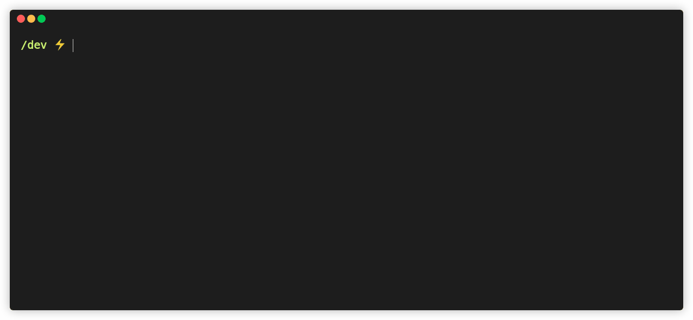

<div align="center">
	<br>
	<br>
	
	<br>
	<br>

📝 Generate API documentation in Markdown from [apiDoc](https://github.com/apidoc/apidoc) data

[](https://github.com/rigwild/apidoc-markdown/actions)
[](https://www.npmjs.com/package/apidoc-markdown)
[](https://www.npmjs.com/package/apidoc-markdown)
[](./LICENSE)



</div>

## Motivation

I really like the idea of generating API documentations with simple annotations like [apiDoc](https://github.com/apidoc/apidoc) does.

Unfortunately, [apiDoc](https://github.com/apidoc/apidoc) outputs a big HTML/CSS/JavaScript project which is not ideal when you want to add it to your GIT project.

`apidoc-markdown` lets you convert data from [apiDoc](https://github.com/apidoc/apidoc) to a nice and portable Markdown documentation! 😊

This project is a full-rewrite fork of [@martinj/node-apidoc-markdown](https://github.com/martinj/node-apidoc-markdown), which transfered the npm package name `apidoc-markdown` to me.

## Before starting using `apidoc-markdown`

`apidoc-markdown` uses data generated by [apiDoc](https://github.com/apidoc/apidoc). To generate your nice Markdown documentation, you first need to add some [apiDoc](https://github.com/apidoc/apidoc) API documentation comments in your code.

Take a look at https://apidocjs.com/ to discover it if it's your first time using it! 😉

You create your API documentation directly in your code with comments like this:

```ts
/**
 * @api {post} /admin/invite/new Send Invite
 * @apiPermission GlobalAdmin
 * @apiDescription Create & email a new Strider invite.
 * @apiName SendInvite
 * @apiGroup Admin
 * @apiVersion 1.0.0
 *
 * @apiExample {curl} CURL Example:
 *    curl -X POST -d invite_code=xoxox -d email=me[at]email.com http://localhost/invite/new
 *
 * @apiParam (RequestBody) {String} invite_code The invite code/token to use in the invitation
 * @apiParam (RequestBody) {String} email The email address of the new user being invited
 */
app.post('/invite/new', (req, res) => {/* ... */})
```

## How does it look? Give me some examples!

Some examples are available in the [`example`](./example) directory.

Take a look at [`example/strider/api.md`](./example/strider/api.md) which shows a real-world example taken from the [Strider](https://github.com/Strider-CD/strider) API.

## Install

```bash
# For the command line utility
yarn global add apidoc-markdown
# npm i -g apidoc-markdown

# For programmatic usage
yarn add apidoc-markdown
# npm i apidoc-markdown
```

Then, generate your documentation using your newly added command `apidoc-markdown` or [programmatically](#programmatic-usage-API).

**Note**: Node.js v12+ minimum is required.

## CLI usage

```
Generate Markdown documentation from apiDoc data.
Usage: apidoc-markdown -p <path> -o <output_file> [-t <template_name>] [--multi] [--createPath] [--prepend <file_path>]

Options:
      --version     Show version number                                                                                                      [boolean]
  -p, --apiDocPath  Path to generated apiDoc output directory. Where `api_data.json` and `api_project.json` resides.               [string] [required]
  -o, --output      Output file or directory to write output to.                                                                   [string] [required]
  -t, --template    Name of the template to be used (`default`, `bitbucket`) or path to an EJS template file. If not specified, the default template
                    is used                                                                                              [string] [default: "default"]
      --header      Path to file content to add at the top of the documentation.                                                              [string]
      --footer      Path to file content to add at the bottom of the documentation.                                                           [string]
      --prepend     Path to file content to add before route groups documentation.                                                            [string]
      --multi       Output one file per group to the `output` directory.                                                    [boolean] [default: false]
      --createPath  Recursively create directory arborescence to the `output` directory.                                    [boolean] [default: false]
  -h, --help        Show help                                                                                                                [boolean]

Examples:
  apidoc-markdown -p doc/ -o doc.md                     Generate from `doc/` apiDoc output to `./doc.md`
  apidoc-markdown -p doc/ -o doc.md -t bitbucket        Generate from `doc/` apiDoc output to `./doc.md` using the bitbucket template
  apidoc-markdown -p doc/ -o doc.md -t ./mytemplate.md  Generate from `doc/` apiDoc output to `./doc.md` using a provided template file
  apidoc-markdown -p doc -o multi --multi --createPath  Generate from `doc/` apiDoc output to `./multi/<group>.md`

apidoc-markdown - https://github.com/rigwild/apidoc-markdown
```

### Command-line arguments

| Option      | Alias         | Description |
| ----------- | ------------- | ----------- |
| `--help` | `-h` | Show help message |
| `--apiDocPath <apiDoc_path>` | `-p` | Path to generated apiDoc output directory. Where `api_data.json` and `api_project.json` resides. |
| `--output <output_path>` | `-o` | Output file or directory to write output to. |
| `--template <template_path>` | `-t` | Name of the template to be used (`default`, `bitbucket`) or path to an EJS template file. If not specified, the [default template](./templates/default.md) is used (see [Examples](#examples)). |
| `--header <file_path>` |  | Path to file content to add at the top of the documentation. |
| `--footer <file_path>` |  | Path to file content to add at the bottom of the documentation. |
| `--prepend <file_path>` |  | Path to file content to add before route groups documentation. |
| `--multi` |  | Output one file per group to the `--output` directory. |
| `--createPath` |  | Recursively create directory arborescence to the `--output` directory |

See [Examples](#examples) for usage examples.

## Quick and easy project integration

Install [apiDoc](https://github.com/apidoc/apidoc) and [apidoc-markdown](https://github.com/rigwild/apidoc-markdown) as dev dependencies

```bash
yarn add -D apidoc apidoc-markdown
# npm i -D apidoc apidoc-markdown
```

Add the following script to your `package.json` file (`src` is where are stored your source files containing some [apiDoc](https://apidocjs.com/) annotations).

```json
{
  "scripts": {
    "doc": "apidoc -i src -o apidoc-out && apidoc-markdown -p apidoc-out -o DOCUMENTATION.md && rm -rf apidoc-out"
  }
}
```

Run the npm script to generate the `DOCUMENTATION.md` file.

```bash
yarn doc
# npm run doc
```

___

## Programmatic usage API

#### generateMarkdown

Generate mardown documentation.

```ts
generateMarkdown: (config: ConfigurationObject) => Promise<{ name: string, content: string }[]>
```

See [`./src/types`](./src/types.ts).

```ts
export declare interface ConfigurationObject {
  /** apiDoc project JSON data object (`api_project.json` (or legacy `apidoc.json`) file content) */
  apiDocProjectData: { [key: string]: any }

  /** apiDoc documentation JSON data object (`api_data.json` file content) */
  apiDocApiData: { [key: string]: any }[]

  /** Name of template to be used (`default`, `bitbucket`)
   * or path to EJS template file
   * or raw EJS plain text template
   * (will use default template if ommitted). */
  template?: string

  /** Content to add at the top of the documentation */
  header?: string

  /** Content to add at the bottom of the documentation */
  footer?: string

  /** Content to add before route groups documentation */
  prepend?: string

  /** Generate one documentation output per group */
  multi?: boolean
}
```

Usage example:

```ts
import { generateMarkdown } from 'apidoc-markdown'

const documentation = await generateMarkdown({
  apiDocProjectData: { name: 'test', version: '0.13.0', /* ... */ },
  apiDocApiData: [{ type: 'get', url: '/define', /* ... */ }],
  template: 'my EJS template <%= project.name %> v<%= project.version %>' /* or ('default' | 'bitbucket') or path to template */,
  // header: 'Add this text at the top of the doc!',
  // footer: 'Add this text at the bottom of the doc!',
  // prepend: 'Prepend this before the API routes documentation!',
  // multi: false
})

// Output
documentation: {
  name: string; // Group name
  content: string; // Documentation content
}[]

// (if `multi` === false, you get an array with 1 element!)
```

#### generateMarkdownFileSystem

Generate mardown documentation using the file system and creating output file(s).

```ts
generateMarkdownFileSystem: (config: ConfigurationObjectCLI) => Promise<{ outputFile: string, content: string }[]>
```

See [`./src/types`](./src/types.ts).

```ts
export declare interface ConfigurationObjectCLI {
  /** Path to generated apiDoc output directory. Where `api_data.json` and `api_project.json` are located */
  apiDocPath: string

  /** Output file or directory to write output to */
  output: string

  /** Name of template to be used (`default`, `bitbucket`)
   * or path to EJS template file
   * or raw EJS plain text template
   * (will use default template if ommitted). */
  template?: string

  /** Path to file content to add at the top of the documentation */
  header?: string

  /** Path to file content to add at the bottom of the documentation */
  footer?: string

  /** Path to file content to add before route groups documentation */
  prepend?: string

  /** Output one file per group to the `output` directory */
  multi?: boolean

  /** Recursively create directory arborescence to the `output` directory */
  createPath?: boolean
}
```

Usage example:

```ts
import path from 'path'
import { generateMarkdownFileSystem } from 'apidoc-markdown'

const documentation = await generateMarkdownFileSystem({
  apiDocPath: path.resolve(__dirname, 'path', 'to', 'apiDoc', 'output', 'files', 'directory'),
  output: path.resolve(__dirname, 'output'),
  template: 'default' /* or 'bitbucket' or path to template or raw EJS plain text template */,
  // header: path.resolve(__dirname, 'path', 'to', 'file', 'to', 'add-to-the-top'),
  // footer: path.resolve(__dirname, 'path', 'to', 'file', 'to', 'add-to-the-bottom'),
  // prepend: path.resolve(__dirname, 'path', 'to', 'file', 'to', 'prepend-to-api-routes'),
  // multi: true,
  // createPath: true
})

// Output
documentation: {
  outputFile: string; // File path
  content: string; // File content
}[]

// (if `multi` === false, you get an array with 1 element!)
```

___

## Configuration

### Using apidoc.json

The `header`, `footer` and `prepend` options can be configured directly in your `apidoc.json`.

Add it like this:

```json
{
  "name": "test",
  "version": "0.1.2",
  "description": "test",
  "title": "test",
  "url": "https://test.example.com/",
  "header": {
    "filename": "doc/header.md"
  },
  "footer": {
    "filename": "doc/footer.md"
  },
  "prepend": {
    "filename": "doc/prepend.md"
  }
}
```

**Note:** This only works if you use the CLI or [`generateMarkdownFileSystem`](#generateMarkdownFileSystem). It will not work if you use [`generateMarkdown`](#generateMarkdown).

### Groups order

You can choose the order in which the documentation groups gets generated by adding an `order` key in `api_project.json` (or `apidoc.json`). [See example `api_project.json`](./test/_apidoc/out/api_project.json#L15-L22) and [generated example output](./example/basic/example.md).

**Note:** This in only available when generating the documentation to a single output file (the `multi` mode generates 1 file per group, so there is nothing to sort).

## Examples

### Generate apiDoc data

`apidoc-markdown` requires `apiDoc` generated data (only [`api_data.json`](./test/_apidoc/out/api_data.json) and [`api_project.json`](./test/_apidoc/out/api_project.json), you can essentially delete every other apiDoc-generated files).

```
apidoc -i src -o apidoc-out
```

### Basic example

Generate documentation from the included example data (See [`./example/basic/example.md`](./example/basic/example.md)).

```
apidoc-markdown -p test/_apidoc/out -o ./example/basic/example.md
```

You can select a specific template by its name by using `-t` or `--template` (`default`, `bitbucket`).

```
apidoc-markdown -p test/_apidoc/out -o ./example/basic/example.md -t bitbucket
```

You can pass the path to your own template by using `-t` or `--template` (`default`, `bitbucket`).

```
apidoc-markdown -p test/_apidoc/out -o ./example/basic/example.md -t ./mytemplate.md
```

You can inject a header, footer or prepend section in your documentation with the content of a file using `--header`, `--footer` and `--prepend`.

```
apidoc-markdown -p test/_apidoc/out -o ./example/basic/example.md  --header test/_testFiles/header.md
apidoc-markdown -p test/_apidoc/out -o ./example/basic/example.md  --footer test/_testFiles/footer.md
apidoc-markdown -p test/_apidoc/out -o ./example/basic/example.md  --prepend test/_testFiles/prepend.md

apidoc-markdown -p test/_apidoc/out -o ./example/basic/example.md  --header test/_testFiles/header.md --footer test/_testFiles/footer.md --prepend test/_testFiles/prepend.md
```

### Multi-files example

Generate documentation from the included example data, one file per group and creating the parent directory of the output (See [`./example/multi`](./example/multi)).

```
apidoc-markdown -p test/_apidoc/out -o ./example/multi --multi --createPath
```

## Contribute

Suggest any feature you would like by creating an [issue](https://github.com/rigwild/apidoc-markdown/issues) or a [pull request](https://github.com/rigwild/apidoc-markdown/pulls).

When reporting bugs, please fill the issue template correctly with as much info as possible to help me debug and understand what's happening.

⭐ Star the project to help it grow! 😄

## License

[The MIT license](./LICENSE)
